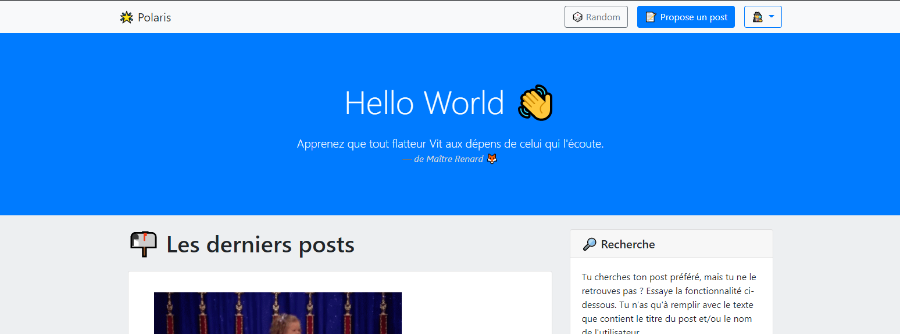

# Polaris project

<div align="center">
    <p>
        
    </p>
</div>

Nous avions choisi de travailler sur Lumen, on a décidé de créer une plateforme web appelé Polaris.
Le concept de cette plateforme est la visualisation et le partage de post qui sont composés d’images ou de gifs avec un titre et une description (cf les joies du codes). 

## Installation

Créer la base de données mysql et vérifié que ce sont bien les bonnes données de connection dans le fichier `.env`.
Ainsi, si vous souhaitez directement importer le fichier SQL s'est [par ici](#autre-données).

Ensuite pour installer toutes les dépendances :

```
composer install
```

### Migration

Pour créer les différentes tables de la base de données.

info dev: 
> Pour éviter de ce prendre la tête et aller plus rapidement, on ne créer pas de nouveau fichier de migration pour modifier une entité.
On modifie directement le dossier déjà éxistant.
[La documentation Laravel](https://laravel.com/docs/8.x/migrations)

```
php artisan migrate
```

### Seeder

Pour avoir des fausses données vous pouvez faire la commande suivante :

```
php artisan db:seed
```

### Autre données

Sinon afin d'avoir des données plus réel importé directement le [fichier SQL](https://github.com/AH-REM/Polaris/releases/download/v1.0/database.sql) dans votre base de données.
Pour ce qui est des mot de passe, les utilisateur classique ont le même que leur nom (example: username: admin / password: admin) sinon le mot de passe est `password`.

## Démarrage

```
php -S localhost:8000 -t public
```
